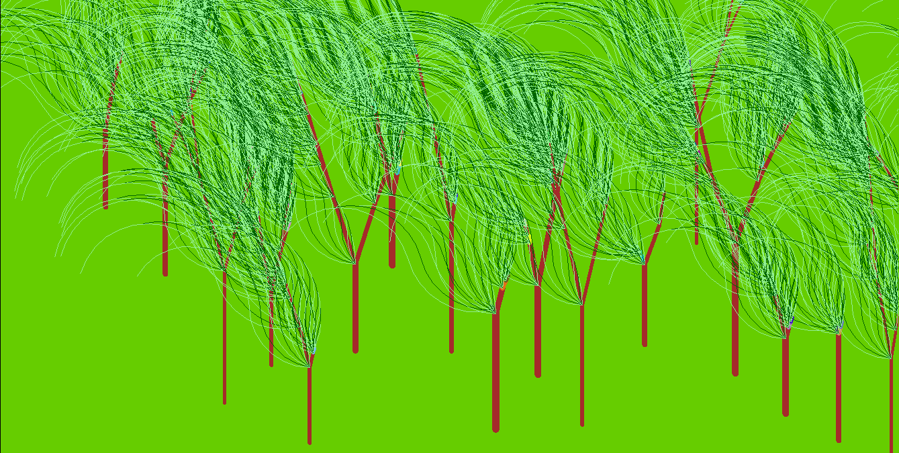
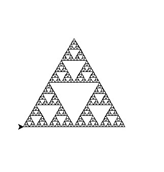

-my homework:
-to do this homework i have passed lots of pressure.sometimes i was confused but i finally i come up with it.
-we should be acquainted with some libraries of python for instance turtle,random, math ,... and importantly recursive functions. 
-

 
 

 