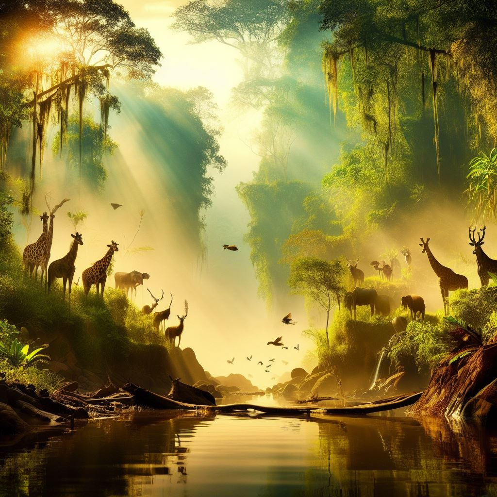
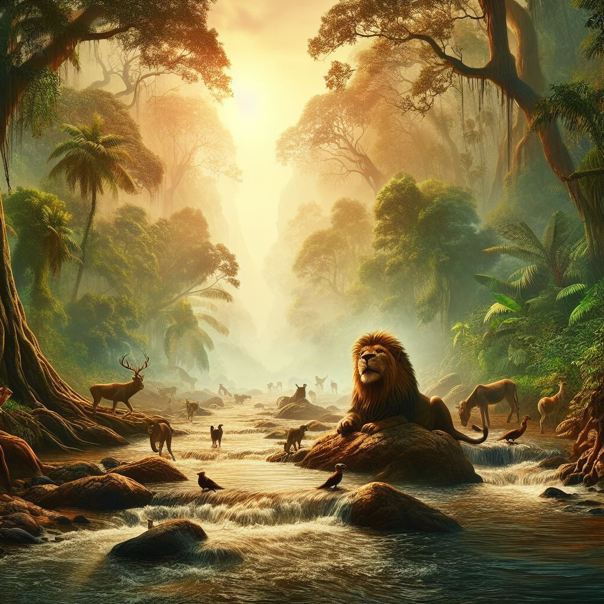
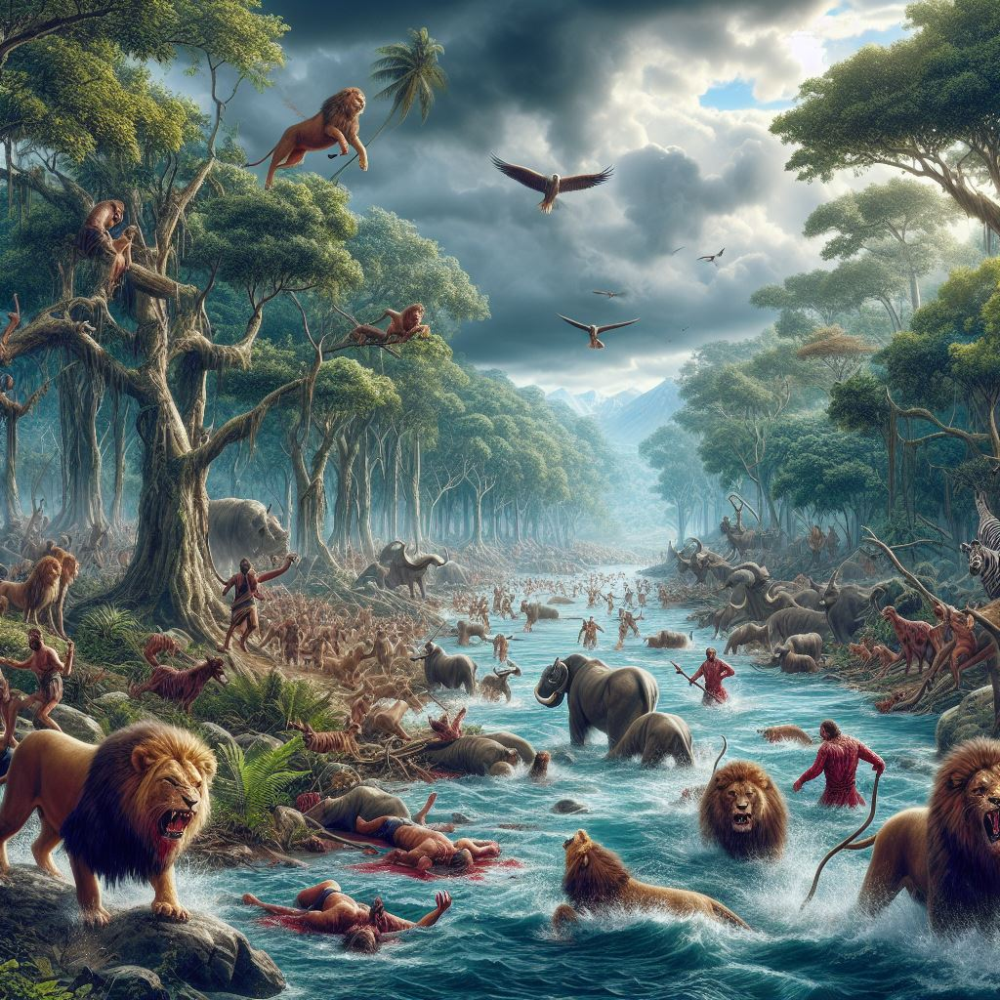

-my homework:
 

 
 

-To create this image in bing.com/create i have written "jungle across the river with animals in peace"
-
-

-
-
-
 
 
-to editing this image i wrote"river across the jungle and in this jungle the lion king creates the unity and peace among the animals "
-
-

 
 

-
-
-

 